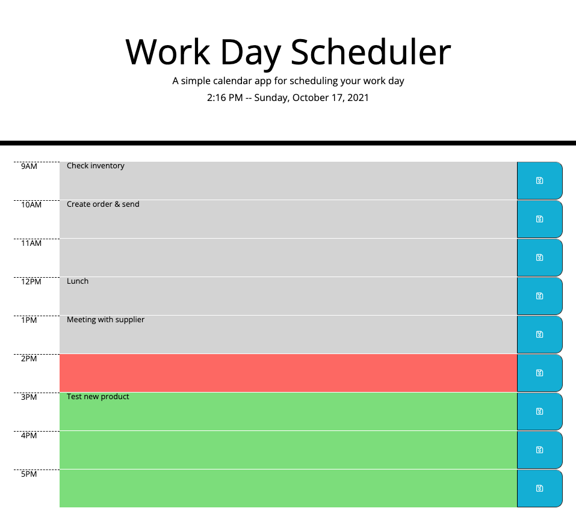

# Work Day Scheduler

Live App: [Work Day Scheduler](http://highdynamics.github.io/work-day-scheduler)
  

## Description

Based on a 9-5 workday, record activies by the hour.

**Features**
- Clock and date display, updated every 60 seconds
- Persist input data in local storage by clicking the 'save' button
- Color coded hour blocks for 'past' (grey), 'present' (red), and 'future' (green), updated every 60 seconds
    - From 6PM-7PM, all blocks are considered 'past' - From 7PM-9AM, all blocks are considered 'future'.

Forked from: [coding-boot-camp/super-disco](http://github.com/coding-boot-camp/super-disco)  
Starter Code by: [Xandromus](https://github.com/Xandromus)